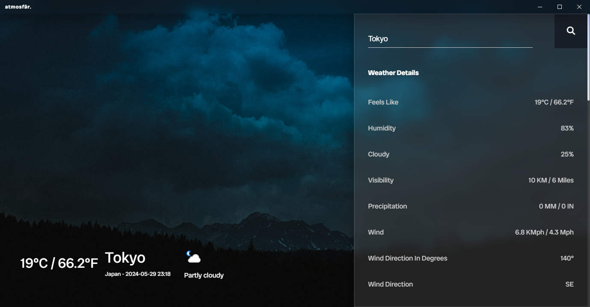

<h1 align="center">Atmosfär Weather App -  The Weather At Your Fingertips 🌞</h1>



<p>
  
  
  
</p>

> Atmosfär Is Weather App Built Using HTML, CSS & JS On Top Of Electron.js Library As A Desktop App. Uses Hydraulic Conveyor For Builds/Updates

Changelogs For The App Available [Here](https://adac.vercel.app/) (Scroll Down To See Latest Version).

### Download App From [Here!](https://sahalmoh.github.io/Atmosfar/download.html)

## Install Dependencies

First Install Hyddraulic Conveyor NPM Package Then The Others

```sh
npm install -g @hydraulic/conveyor
```
```sh
npm i
```

## Start App

Get Your API Key From [WeatherAPI](https://www.weatherapi.com/)

Make A .env File With

```env
WEATHER_API_KEY=<YOUR_API_KEY>
```

Then You Can Start App By

```sh
conveyor run
```


## Author

👤 **Sahal**

* Github: [@SahalMoh](https://github.com/SahalMoh)

## Show your support

Give a ⭐️ if this project helped you!

***
_This README was generated with ❤️ by [readme-md-generator](https://github.com/kefranabg/readme-md-generator)_

_This Project Follows <a href="https://gitmoji.dev/">Gitmoji</a> For Commit Messages._

_Powered By:_

<a href="https://www.weatherapi.com/" title="Free Weather API"></a>