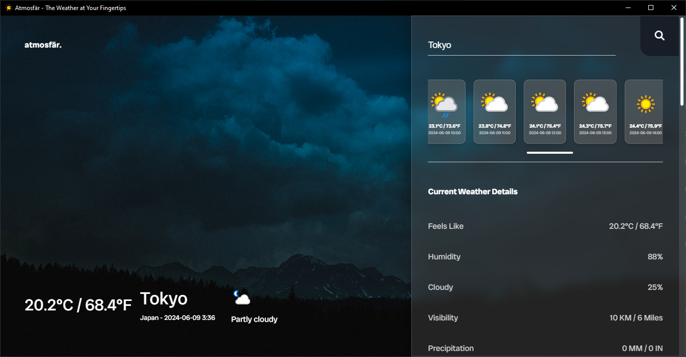

<h1 align="center">Atmosfär Weather App -  The Weather At Your Fingertips 🌞</h1>



<p>
  
  
</p>

> Atmosfär Is Weather App Built Using HTML, CSS & JS On Top Of Electron.js Library As A Desktop App.

Changelogs For The App Available [Here](https://adac.vercel.app/) (Scroll Down To See Latest Version).

## Install Dependencies

```sh
yarn install
```

## Start App

```sh
yarn start
```

## Author

👤 **Sahal**

* Github: [@SahalMoh](https://github.com/SahalMoh)

## Show your support

Give a ⭐️ if this project helped you!

***
_This README was generated with ❤️ by [readme-md-generator](https://github.com/kefranabg/readme-md-generator)_

_This Project Follows <a href="https://gitmoji.dev/">Gitmoji</a> For Commit Messages._